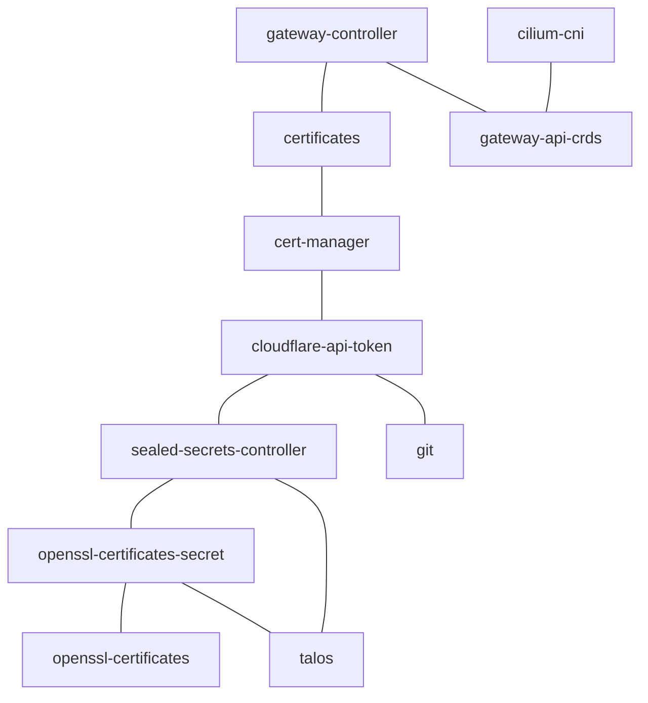

<div align="center">

# 🪨 Talos K8s Cluster 🔬

Repository for test infrastructure and [Kubernetes](https://kubernetes.io/) cluster
using [GitOps](https://en.wikipedia.org/wiki/DevOps) practices.

Held together using [Proxmox VE](https://www.proxmox.com/en/proxmox-virtual-environment),
[OpenTofu](https://opentofu.org/), [Talos](https://talos.dev), [Kubernetes](https://kubernetes.io/),
[Argo CD](https://argoproj.github.io/cd/) and copious amounts of [YAML](https://yaml.org/) with some help
from [Renovate](https://www.mend.io/renovate/).

</div>

---

## 📖 Overview

This repository hosts the IaC ([Infrastructure as Code](https://en.wikipedia.org/wiki/Infrastructure_as_code))
configuration for my test lab.

The test lab is backed by [Proxmox VE](https://www.proxmox.com/en/proxmox-virtual-environment) hypervisor nodes with VMs
bootstrapped using [OpenTofu](https://opentofu.org/)/[Terraform](https://www.terraform.io/).

Most of the services run on [Talos](https://www.talos.dev/) flavoured [Kubernetes](https://kubernetes.io/),
though I'm also running a [TrueNAS](https://www.truenas.com/) VM for storage
and [Home Assistant](https://www.home-assistant.io/) VM for home automation.

To organise all the configuration I've opted for an approach using Kustomized Helm
with [Argo CD](https://argoproj.github.io/cd/) which I've explained in more
detail [in this article](https://blog.stonegarden.dev/articles/2023/09/argocd-kustomize-with-helm/).

I journal my test lab journey over at my self-hosted [blog](https://blog.stonegarden.dev).

## 🧑‍💻 Getting Started

If you're new to Kubernetes I've written a fairly thorough guide
on [Bootstrapping k3s with Cilium](https://blog.stonegarden.dev/articles/2024/02/bootstrapping-k3s-with-cilium/).
In the article I try to guide you from a fresh Debian 12 Bookworm install to a working cluster using
the [k3s](https://k3s.io) flavour of Kubernetes with [Cilium](https://cilium.io) as a [CNI](https://www.cni.dev)
and [IngressController](https://kubernetes.io/docs/concepts/services-networking/ingress-controllers/).

I've also written an article on how to get started
with [Kubernetes on Proxmox](https://blog.stonegarden.dev/articles/2024/03/proxmox-k8s-with-cilium/) if virtualisation
is more your thing. 

The current iteration of my test lab runs on [Talos](https://talos.dev) Kubernetes and is set up according 
to [this article](https://blog.stonegarden.dev/articles/2024/08/talos-proxmox-tofu/).

## ⚙️ Core Components

* [Proxmox VE](https://www.proxmox.com/en/proxmox-virtual-environment): Server management and KVM hypervisor.
* [OpenTofu](https://opentofu.org/): Open source infrastructure as code tool.
* [Cilium](https://cilium.io/): eBPF-based Networking, Observability, Security.
* [Proxmox CSI Plugin](https://github.com/sergelogvinov/proxmox-csi-plugin): CSI driver for storage
* [Argo CD](https://argo-cd.readthedocs.io/en/stable/): Declarative, GitOps continuous delivery tool for Kubernetes.
* [Cert-manager](https://cert-manager.io/): Cloud native certificate management.
* [Sealed-secrets](https://github.com/bitnami-labs/sealed-secrets): Encrypt your Secret into a SealedSecret, which is
  safe to store - even inside a public repository.
* [Keycloak](https://www.keycloak.org/): Open source identity and access management
* [Gateway API](https://gateway-api.sigs.k8s.io/): Next generation of Kubernetes Ingress
* [AdGuardHome](https://github.com/AdguardTeam/AdGuardHome): Domain name server backed by Unbound
* [Netbird](https://netbird.io/): Completely self hosted VPN solution

## 🗃️ Folder Structure

```shell
.
├── 📂 docs                # Documentation
├── 📂 k8s                 # Kubernetes manifests
│   ├── 📂 apps            # Applications
│   ├── 📂 infra           # Infrastructure components
│   └── 📂 sets            # Bootstrapping ApplicationSets
└── 📂 tofu                # Tofu configuration
    ├── 📂 home-assistant  # Home Assistant VM
    └── 📂 kubernetes      # Kubernetes VM configuration
        ├── 📂 bootstrap   # Kubernetes bootstrap config
        └── 📂 talos       # Talos configuration 
```

## Kubernetes Components Dependency Graph



## 🏃‍➡️ Setup

> **_NOTE:_** Proxmox should be deployed and accessible via `ssh root@proxmox.lan`. Local `SSH ID file` should be copied into `/root/.ssh/authorized_keys` (`~/.ssh/id_rsa.pub`)

First, we create Terraform variables file `k8s.auto.tfvars` in `talos/cluster` folder with main configuration:

```json
#talos/cluster/k8s.auto.tfvars
api_token_id = "root@pam!terraform"

proxmox = {
  name         = "proxmox"
  cluster_name = "proxmox"
  endpoint     = "https://proxmox.lan:8006"
  insecure     = true
  
  ssh_username            = "root"
  ssh_private_key_file    = "~/.ssh/id_rsa"
}
```

#### Start deployment ...
```bash
$ cd tf
$ make talos
```

### Bootstrap Kubernetes

#### Setup necessary components to start ArgoCD (Cilium, Gateway, cert-manager, CSI plugins)

```bash
$ make bootstrap-k8s
```

### Create Sealed Secrets

#### Light LDAP Secrets
> **_NOTE:_** Light LDAP sealed secrets should be generated only in case main opelssl certificates update	
[link](k8s/infra/auth/lldap/README.md)

### Deploy ArgoCD

```bash
$ make argocd
```

> **_IMPORTANT:_** Next steps depend on ArgoCD sync. Verify that applications are synced `kubectl get Application -n argocd` and gateways are created `kubectl get Gateway -n gateway`

#### Install ArgoCD CLI
```bash
$ brew install argocd
```

#### Retrieve auto generated ArgoCD admin password
```bash
$ argocd admin initial-password -n argocd
<generated password>
```

> **_NOTE:_** There should be an entry for `argocd.local` pointing to `192.168.50.223` in `/etc/hosts`. That is insecure gateway IP address (`k8s/infra/network/gateway/gw-insecure.yaml`)
#### Login into ArgoCD
```bash
$ argocd login argocd.local:80
user: admin
password: <generated password>
```

#### Change admin password
```bash
$ argocd account update-password
```

#### Add ArgoCD account
```bash
$ kubectl config get-contexts -o name
admin@talos
$ argocd cluster add admin@talos
```

#### ArgoCD WebUI

WebUI should be accessible on https://argocd.emisia.net

## Useful Tips:

### TIP 1: Create Test Lab

#### Add test lab branch

> **_NOTE:_** Make sure the code is in `main` git branch

```bash
$ git branch testlab-branch
$ git checkout testlab-branch
```

#### Setup `testlab` folder

Make `testlab` folder

```bash
$ mkdir k8s/testlab
```
ß
Add ArgoCD project manifest

```yaml
#File k8s/testlab/project.xml
apiVersion: argoproj.io/v1alpha1
kind: AppProject
metadata:
  name: testlab
  namespace: argocd
spec:
  sourceRepos:
    - 'https://github.com/luminosita/k8s-cluster-talos'
  destinations:
    - namespace: 'argocd'
      server: '*'
  clusterResourceWhitelist:
    - group: '*'
      kind: '*'
```

> **_IMPORTANT_**: Make sure to all namespaces used by test application deployments into `spec.destinations`

> **_IMPORTANT_**: Make sure to all additional source code repositories if used by ArgoCD test application manifest into `spec.sourceRepos`

Add ArgoCD test application manifest

```yaml
#File k8s/testlab/test-app.yaml
apiVersion: argoproj.io/v1alpha1
kind: Application
metadata:
  name: test-app
  namespace: argocd
spec:
  project: testlab
  source:
    repoURL: https://github.com/luminosita/k8s-cluster-talos
    targetRevision: testlab-branch
    path: k8s/testlab/test-app
  destination:
    namespace: argocd
    name: in-cluster
  syncPolicy:
    automated:
      selfHeal: true
      prune: true
```

> **_IMPORTANT_**: Make sure to place proper `spec.source.path` and `spec.source.targetRevision` values

Add Kustomization manifest

```yaml
#File k8s/testlab/kustomization.yaml
apiVersion: kustomize.config.k8s.io/v1beta1
kind: Kustomization
namespace: argocd

resources:
  - project.yaml
  - test-app.yaml
```
